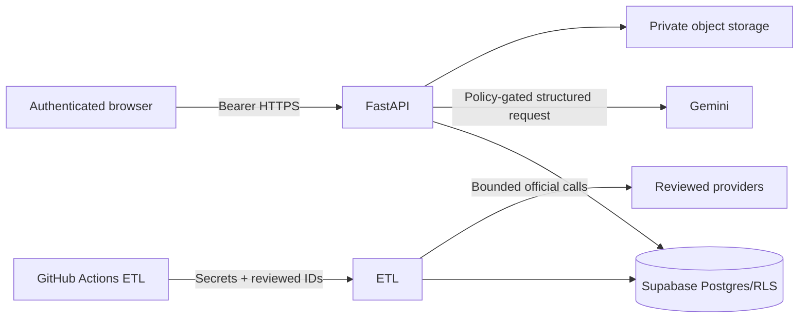

# Backend trust-boundary threat model

Last reviewed: 2026-08-23

Protected assets include credentials, harmful source text/OCR, provider
payloads, author identifiers, prompts, review context, and user-owned records.

| Boundary | Threat | Controls |
|---|---|---|
| Browser → API | anonymous/cross-user access | JWT verification, authenticated router, owner/role checks, forced RLS tests |
| Browser → URL fetch | SSRF/oversize/polyglot | DNS and redirect checks, public HTTP(S), time/byte/MIME bounds |
| Scheduler → ETL | arbitrary source/query/path, overlap | source choices plus runtime allowlists, stable seed/datapack IDs, concurrency group |
| ETL → provider | quota/outage/partial page | timeouts, bounded retries, checkpoints, item isolation, partial coverage |
| Service → Gemini | prohibited transfer/injection/invention | transfer gate, data/instruction separation, no tools, schema and citation evals |
| Service → DB | injection/stale identity/raw read | parameterized queries, identity per transaction, safe views, forced RLS |
| Service → storage | public object/long URL | private storage, expiring signed URLs, no bytes in API/logs |
| Reporting | automatic/mass reporting | authentication, per-user limits, reviewed policies, no sending capability |
| Research exports | cross-user/raw bulk disclosure | owner/reviewer checks, immutable aggregate snapshots, redaction, no raw item export |
| Logs/artifacts | content/secret leakage | correlation allowlist, key redaction, bounded values, safe summary schema |

Residual risks, including multi-instance IP limiting and provider approval, are
listed in the deployment runbook.
