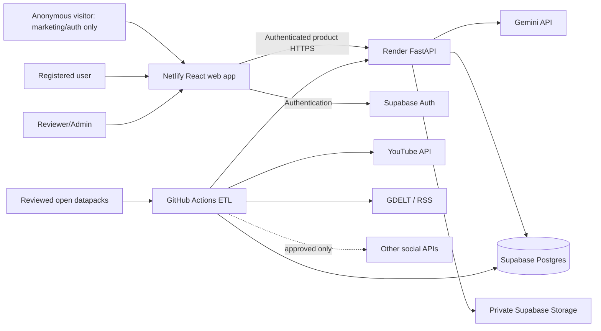

# Project Amanah — Developer-Ready Product Specification

**Version:** 2.2  
**Date:** 2026-08-23  
**Status:** Approved product direction; ready for hackathon implementation  
**Delivery constraint:** 48-hour hackathon  
**Primary language:** English  
**Initial geographic focus:** Canada, United States, and United Kingdom  
**Business model:** Free; no monetization in scope

## 1. Document purpose

This specification is the implementation source of truth for the hackathon version of Project Amanah. It consolidates the product discussion and supersedes conflicting product assumptions in the earlier documents under `docs/`.

Earlier documents remain useful technical references, but the following decisions in this file take precedence:

- Research-oriented users are the primary audience.
- Only the marketing homepage and the static education lesson library are public product content; authentication entry/callback routes remain reachable solely to establish a session (v2.2, ADR 0008).
- The dashboard, news, findings, item pages, methodology, the reviewed resource catalog data, forum placeholder, reports, contributions, and all other application surfaces require authentication.
- Current events and researcher-facing insights are the core experience.
- Education/resources, user contributions, classification disputes, assisted platform reporting, PDF reports, filters, and transparent AI-confidence displays are in scope.
- Social sharing is a mock in the hackathon.
- Comments and a forum are visible as “Coming soon” but are not implemented.
- The application uses English only in the first release.

Requirement keywords use the following meanings:

- **MUST:** required for acceptance.
- **SHOULD:** implement unless time or a documented constraint prevents it.
- **MAY:** optional enhancement.
- **MOCK:** visible and interactive enough to communicate intent, but does not perform the external action.

## 2. Executive summary

Project Amanah is an authenticated research and reporting web application with a public marketing homepage. It monitors and analyzes anti-Muslim hate and Islamophobic rhetoric in online public discourse by combining authorized social-media content, local and major global news, user-submitted public URLs, open research datapacks such as appropriately licensed Kaggle datasets, AI-assisted classification, human correction, and transparent aggregate analysis.

The product helps researchers in sociology, anthropology, socio-political fields, journalism, civil society, and related disciplines answer:

1. What current events involving anti-Muslim hate or Islamophobia are being reported?
2. What proportion of the monitored Muslim-related sample contains likely anti-Muslim rhetoric?
3. Which narratives, hate types, and severity levels are appearing?
4. How are those patterns changing over time and across sources?
5. What evidence supports an AI-generated finding?
6. How can a user responsibly report a likely platform-policy violation?
7. How can users correct false classifications or suggest missing public content?

Amanah measures a bounded monitored sample. It does not claim to measure the beliefs of an entire country, platform, or population.

## 3. Product vision and problem

### 3.1 Problem

Information about anti-Muslim rhetoric is fragmented across platforms, news outlets, isolated screenshots, and research reports. Individual incidents are difficult to contextualize, while manually reviewing large volumes of harmful content is slow and emotionally costly. General sentiment or moderation tools also risk confusing ordinary Muslim speech, neutral reporting, political criticism, quotation, and counterspeech with hate.

### 3.2 Product response

Amanah turns authorized public signals into:

- a current-events overview;
- transparent, filterable aggregate metrics;
- AI-generated but evidence-linked findings;
- item-level summaries and context;
- user-assisted correction and content discovery;
- platform reporting guidance;
- researcher-ready PDF reports; and
- education and support resources.

### 3.3 Product principles

- **Evidence before assertion:** Every quantitative claim MUST trace to deterministic data.
- **Relevance is not hate:** Muslim-related content MUST be classified separately from anti-Muslim rhetoric.
- **Uncertainty stays visible:** AI labels MUST expose confidence tiers and review state.
- **Public marketing, protected application:** Only the marketing homepage is public; every research, content, resource, reporting, and community surface requires an authenticated session.
- **Human correction:** User disputes trigger manual review and MUST NOT directly overwrite a model result.
- **No causal overclaim:** News events may coincide with changes; Amanah MUST NOT state that they caused them.
- **No person profiling:** The system analyzes content and aggregate patterns, not personal identities.
- **Trauma-aware design:** Harmful material is redacted or collapsed by default.
- **Honest integrations:** Fixture or mock data MUST never be presented as live.

## 4. Users and permissions

### 4.1 Primary users

Researchers and research-adjacent users who need evidence and insights about Islamophobia, including people working in sociology, anthropology, socio-political fields, journalism, policy, and civil society.

### 4.2 Secondary users

- Muslims seeking current information and resources.
- Non-Muslim allies seeking awareness and ways to respond.
- Students and members of the general public, including people under 30.

### 4.3 Roles

| Role | Access |
|---|---|
| Anonymous visitor | Marketing homepage plus login, sign-up, password-recovery, and authentication-callback routes needed to establish a session; no dashboard or application data |
| Registered user | Dashboard, news, aggregate insights, redacted item pages, methodology, resources, forum placeholder, URL submission, classification disputes, assisted platform reporting, contribution history, PDF report generation, and future community actions |
| Reviewer | Registered access plus manual review queue, corrected labels, policy-mapping review, and contribution disposition |
| Administrator | Reviewer access plus source configuration, connector status, scheduled runs, resource catalog, platform-policy catalog, and account/role management |

Open registration MAY be enabled for the demo. If open registration creates delivery risk, pre-created accounts MAY be used, but the interface MUST still communicate the intended sign-up flow.

## 5. Goals, non-goals, and success measures

### 5.1 Goals

- Present current headlines and monitored social-media findings in one authenticated research experience.
- Refresh available data approximately every eight hours, subject to provider quotas.
- Make model classification and its uncertainty understandable.
- Allow researchers to filter, sort, inspect, and export findings.
- Let registered users flag false classifications and suggest missing public URLs.
- Guide users through preparing reports for likely platform Terms of Service or policy violations.
- Preserve user contribution and prepared-report histories.
- Provide a credible vertical slice using live data where authorized and explicit fixtures elsewhere.

### 5.2 Non-goals

- Automated submission of reports to social-media platforms.
- Automated takedowns, law-enforcement referrals, or legal determinations.
- Determining whether a person is Muslim or inferring protected attributes.
- Person-level offender rankings, identity resolution, or cross-platform dossiers.
- Population-level prevalence claims.
- Full article reproduction.
- A functioning forum or comments system in the hackathon.
- Production social-media publishing in the hackathon.
- Training a production-grade domain model during the hackathon.
- Non-English analysis or UI.
- Monetization, subscriptions, payments, or advertising.

### 5.3 Hackathon success measures

The demonstration is successful when the following vertical slice works:

1. A visitor opens the marketing homepage and selects the dashboard CTA.
2. The visitor signs up or logs in; a first-time user completes or skips onboarding.
3. The authenticated dashboard displays current news, collection freshness, at least one useful aggregate metric, and one AI-generated finding.
4. The user filters or sorts results and opens an item.
5. The item displays its summary, classification, confidence tier, rationale, source, and related insight.
6. The user completes one action: submit a URL, dispute a classification, or prepare a platform report.
7. The action appears in the user’s contribution history.
8. A reviewer can see and resolve a submitted dispute or contribution.
9. A filtered report can be printed or saved as PDF.
10. Live, fixture, stale, failed, and unavailable states are visually distinguishable.

## 6. Scope and delivery priority

### 6.1 P0 — must function in the demo

- Branded public marketing homepage with primary “Sign in to dashboard” and secondary sign-up actions.
- Authenticated dashboard with headlines, freshness/coverage, key metrics, filters, sorting, and current findings.
- Authenticated item detail page for news and social content.
- AI classification with High/Medium/Low confidence badge on every AI-classified item card.
- Exact score, model version, rationale, and review status in item detail.
- Gemini-generated item summaries and bounded aggregate insights.
- At least one live authorized content source or a clearly disclosed controlled fallback.
- News retrieval through GDELT, curated RSS, or another configured provider.
- Authentication for the entire application beyond the marketing/auth-entry surfaces using Supabase Auth.
- URL-only user content submission.
- Open-datapack import for reviewed CSV or JSONL datasets, including Kaggle and other openly licensed research packs.
- “Not actually hateful” dispute action and reviewer queue.
- “Your Contributions” account area with contribution and dispute status.
- One assisted platform-reporting workflow using a versioned policy fixture/catalog.
- Prepared-report history and manual submitted/outcome tracking.
- Resources and education page with a reviewed starter catalog or clearly labelled research-pending sections.
- First-sign-in onboarding guide.
- Print-optimized report and browser “Save as PDF.”
- Authenticated methodology and limitations page.
- Loading, empty, partial, stale, error, unavailable, fixture, and unauthorized states.
- Responsive and keyboard-accessible experience.

### 6.2 P1 — implement after P0 is stable

- Additional live source adapters when credentials and approval are available.
- Deeper narrative and severity visualizations.
- Time-series comparison against a seven-day baseline.
- News-event association cards using explicitly non-causal language.
- Aggregate CSV export.
- More platform-policy mappings for assisted reporting.
- Reviewer correction of stance, type, severity, and narrative.
- Email or in-app completion notifications for contributions.
- Saved filter views.
- Report history and immutable report snapshots.

### 6.3 Mock in the hackathon

- Share/export reports, news, and statistics to social media.
- External social publishing or account connection.
- Forum tab, which displays “Coming soon.”
- Comments area below items, which displays “Comments coming soon.”
- Unavailable social connectors shown with their real configuration/approval state.

Mock actions MUST be labelled “Demo” or “Coming soon” and MUST NOT imply that an external action occurred.

### 6.4 Post-hackathon

- Production social sharing.
- Forum and comments moderation.
- Additional notification channels.
- Multilingual analysis and RTL UI.
- Automated narrative clustering.
- Near-duplicate meme propagation.
- Organization workspaces and a research API.
- Controlled evidence bundles.
- Full model training and governed active-learning pipeline.

## 7. Information architecture and routes

### 7.1 Unauthenticated routes

| Route | Purpose |
|---|---|
| `/` | Public marketing homepage, value proposition, Amanah story, responsible use, and authentication CTAs; MUST NOT request protected application data |
| `/login` | Login |
| `/signup` | Account creation |
| `/auth/callback` | Authentication provider callback; validates safe internal return state |
| `/recover` | Password-recovery entry if enabled |
| `/resources`, `/resources/:lessonId` | Static education lesson library (v2.2, ADR 0008). Editorial content only; MUST NOT fetch any `/v1` product API. The reviewed resource catalog (`/v1/resources`) remains authenticated and is surfaced inside the workspace |

### 7.2 Authenticated routes

| Route | Purpose |
|---|---|
| `/onboarding` | First-sign-in product tour |
| `/dashboard` | Current headlines, aggregate metrics, findings, filters, and sorting |
| `/items/:id` | Authenticated-safe item detail, summary, AI analysis, provenance, and actions |
| `/news` | Filterable news/current-events listing; MAY be integrated into the dashboard for P0 |
| `/resources` (catalog data) | Reviewed research, reporting, support, and getting-involved resource catalog served by `/v1/resources`; the static lesson library at the same path is public per §7.1 |
| `/methodology` | Sources, sampling, taxonomy, models, confidence, limitations, and disclosures |
| `/forum` | “Coming soon” page |
| `/contributions` | Submitted URLs, disputes, prepared reports, and future comments/posts |
| `/contributions/:id` | Contribution status and final disposition |
| `/reporting/:itemId` | Assisted platform-report preparation |
| `/reports/new` | Filter-scoped research report builder |
| `/reports/:id` | Report preview and PDF/CSV actions |
| `/settings` | Account and content-safety preferences |

### 7.3 Reviewer and admin routes

| Route | Purpose |
|---|---|
| `/review` | Unified queue for model classifications, disputes, and submitted URLs |
| `/review/:taskId` | Review context and append-only decision |
| `/admin/sources` | Source/query configuration and connector health |
| `/admin/runs` | Collection runs and safe errors |
| `/admin/resources` | Education-resource catalog moderation |
| `/admin/policies` | Platform-policy catalog and version management |

## 8. Core user journeys

### 8.1 Authenticated discovery

```text
Marketing homepage → Sign in / Sign up → Onboarding if first sign-in
 → Dashboard → Scan headlines and metrics
 → Apply filters/sort → Open item → Read summary and AI insight
 → Follow full-article/source link or choose an application action
```

### 8.2 Authentication and onboarding

1. An anonymous visitor selects a marketing CTA or requests a protected application URL.
2. The application preserves only a validated internal destination, defaulting to `/dashboard`.
3. The visitor signs up or logs in through an unauthenticated auth-entry route.
4. A first-time user sees a skippable onboarding guide covering:
   - dashboard navigation;
   - what the headline, metrics, filters, confidence tiers, and review labels mean;
   - primary actions: submit content, dispute a classification, prepare a platform report, and generate a PDF.
5. The user enters the intended protected route or `/dashboard`.
6. Completion or skip state is stored in the user profile.

### 8.3 Item exploration

For a news item, the page MUST show:

- headline, publisher, publication time, geography, and source link;
- Amanah summary, insights, narrative tags, and related aggregate context;
- a button to open the full publisher article;
- no reproduction of the complete article unless its license explicitly permits it.

For a social item, the page MUST show:

- redacted or collapsed content preview;
- platform, publication/observation times, permitted source link, and bounded context;
- likely classification, hate types, severity, narrative, confidence tier, rationale, and model version;
- human-review state;
- “This is not hateful” and “Prepare a platform report” actions.

### 8.4 Assisted platform reporting

```text
Item → Prepare platform report → Login if needed
 → Show candidate platform policies and uncertainty
 → User selects/confirms relevant violation
 → Amanah prepares evidence summary + relevant rule + suggested wording
 → User opens the official platform reporting page and submits manually
 → Amanah saves a prepared-report record
 → User may later mark submitted and record the platform outcome
```

The system MUST NOT claim that content violates a policy with certainty. Use “possible policy match” until confirmed by a human or the platform. It MUST NOT submit the report automatically.

### 8.5 Classification dispute

```text
Item → This is not hateful → Login if needed
 → Optional reason/context → Submit
 → Create manual-review task → Show Pending in Your Contributions
 → Reviewer confirms or corrects → User sees final outcome
 → Approved correction enters a governed training-candidate pool
```

Corrections MUST NOT automatically retrain or modify the production model. A reviewed, versioned dataset release and evaluation gate are required.

### 8.6 Suggest missing content

```text
Submit content → Paste public URL → Validate and deduplicate
 → Show “Processing” → Scheduled pipeline retrieves and analyzes URL
 → Display status in Your Contributions → Link to resulting item when complete
```

User-submitted items MUST pass through the same canonicalization, classification, safety, provenance, and review pipeline as collected items. Their origin is recorded as `user_submitted`.

### 8.7 Research report

```text
Dashboard filters → Generate report
 → Preview scope, coverage, charts, findings, sources, and limitations
 → Create immutable snapshot → Print / Save as PDF
```

## 9. Functional requirements

### 9.1 Homepage

- **FR-HOME-001:** The homepage MUST explain the problem, intended users, and value within the first viewport.
- **FR-HOME-002:** The primary CTA MUST be “Sign in to dashboard,” with a secondary sign-up action when registration is enabled.
- **FR-HOME-003:** The page MUST explain that Amanah measures a monitored sample and uses AI with human correction.
- **FR-HOME-004:** The page SHOULD explain the name Amanah as a trust and responsibility without presenting the application as a religious authority.
- **FR-HOME-005:** The page MUST link to Login and Sign up. Methodology and Resources MAY be described in marketing copy but their application routes require authentication.
- **FR-HOME-006:** The marketing page MUST render without a session and MUST NOT call dashboard, item, news, methodology, resource, report, or connection-status APIs.

### 9.2 Dashboard and headlines

- **FR-DASH-001:** The first content section MUST present current major headlines relevant to Islamophobia or anti-Muslim hate.
- **FR-DASH-002:** Headline cards MUST contain headline, source, timestamp, geography/scope, short summary, topic labels, and item link.
- **FR-DASH-003:** The dashboard MUST display data freshness and collection coverage before or beside aggregate metrics.
- **FR-DASH-004:** The dashboard MUST display observed count, Muslim-related count, likely anti-Muslim count, likely anti-Muslim rate, reviewed count, and change where sufficient history exists.
- **FR-DASH-005:** Every rate MUST expose numerator, denominator, date window, source scope, and fixture/live status.
- **FR-DASH-006:** Missing data MUST render as a gap or warning, never as zero.
- **FR-DASH-007:** Users MUST be able to open supporting items from a metric or chart.
- **FR-DASH-008:** The dashboard MUST require a valid authenticated session and redirect unauthenticated browser navigation to login with a validated internal return target.

### 9.3 Filters and sorting

The authenticated dashboard MUST support:

- date range;
- content kind: news or social;
- source/platform;
- dataset provider/package/version for open-datapack records;
- country/region when explicitly known;
- narrative/topic;
- severity;
- review state; and
- AI confidence tier.

For records imported from open datapacks, the public `source/platform` value MUST be `N/A`. Dataset provider/name/version remain available as separate provenance and filter fields; `N/A` MUST NOT erase dataset lineage.

Sorting MUST support newest, oldest, highest confidence, lowest confidence, and highest severity where relevant.

- **FR-FILTER-001:** Active filters MUST be visible and resettable.
- **FR-FILTER-002:** Filter state SHOULD be encoded in the URL.
- **FR-FILTER-003:** The backend MUST validate every filter and enforce maximum ranges/result counts.
- **FR-FILTER-004:** An unavailable filter value MUST not silently broaden the query.

### 9.4 AI confidence and review state

- **FR-AI-001:** Every AI-classified item card MUST show High, Medium, or Low confidence.
- **FR-AI-002:** The item detail MUST show exact score, model identifier/version, inference time, rationale, and limitations.
- **FR-AI-003:** Confidence thresholds MUST be versioned and configurable.
- **FR-AI-004:** Provisional defaults MAY be Low `<0.60`, Medium `0.60–0.84`, and High `>=0.85`, but MUST be recalibrated against a reviewed holdout set before production claims.
- **FR-AI-005:** Human states MUST be visually distinct: Model only, Pending review, Confirmed, Corrected, Disputed, or Needs context.
- **FR-AI-006:** Aggregate insights MUST show coverage/evidence quality rather than pretending an item-level model probability is the confidence of the entire conclusion.
- **FR-AI-007:** Low-confidence or uncertain items MUST be eligible for manual review and MUST NOT be presented as confirmed hate.

### 9.5 Classification

The analysis contract MUST separate:

1. **Relevance:** `muslim_related | not_related | uncertain`.
2. **Stance:** `likely_anti_muslim | non_hateful_discussion | counterspeech_or_quotation | uncertain`.
3. **Types:** `animosity | derogation | dehumanization | exclusion | threat_or_incitement | collective_blame | other`.
4. **Severity:** `0 | 1 | 2 | 3`.
5. **Narrative tags:** versioned controlled labels.
6. **Confidence:** numeric model score plus display tier.
7. **Review requirement:** boolean plus reason.

The primary “current sentiment” proxy MUST be named **Likely anti-Muslim rhetoric rate in the monitored sample**, calculated as:

```text
likely_anti_muslim_items / muslim_related_items
```

The interface MUST NOT label this value as the sentiment of all Western users or the general public.

### 9.6 AI-generated insights

- **FR-INSIGHT-001:** Gemini MUST receive a bounded, structured fact bundle rather than unrestricted database access.
- **FR-INSIGHT-002:** Numerical claims MUST be computed by application code or SQL, not by Gemini.
- **FR-INSIGHT-003:** Every quantitative statement MUST cite a stored metric or item identifier.
- **FR-INSIGHT-004:** The output MUST separate observed facts, AI interpretation, possible event association, and unknowns.
- **FR-INSIGHT-005:** Prompt/model version, generation time, source window, and active filters MUST be stored.
- **FR-INSIGHT-006:** Generated output MUST be schema-validated before display.
- **FR-INSIGHT-007:** If Gemini is unavailable, the page MUST retain deterministic metrics and show that the narrative summary is unavailable.

### 9.7 URL submissions

- **FR-SUBMIT-001:** Only authenticated users may submit content.
- **FR-SUBMIT-002:** P0 accepts one public HTTP(S) URL at a time.
- **FR-SUBMIT-003:** The server MUST normalize and validate the URL, reject unsupported schemes, prevent private-network access, and enforce a safe domain/provider policy.
- **FR-SUBMIT-004:** Duplicate canonical URLs MUST link to the existing item or contribution instead of reprocessing unnecessarily.
- **FR-SUBMIT-005:** A valid submission immediately returns `processing`.
- **FR-SUBMIT-006:** Scheduled or manually dispatched processing MUST use the same pipeline as collected content.
- **FR-SUBMIT-007:** The final state MUST be one of `processing | analyzed | duplicate | unsupported | inaccessible | rejected | failed`.
- **FR-SUBMIT-008:** Completed contributions MUST link to the resulting authenticated-safe item.

### 9.8 Classification disputes

- **FR-DISPUTE-001:** Authenticated users may dispute a likely-hate classification.
- **FR-DISPUTE-002:** Only one open dispute per user/item is allowed.
- **FR-DISPUTE-003:** A dispute MUST notify or queue the internal review team.
- **FR-DISPUTE-004:** Review decisions MUST append to history; they MUST NOT overwrite the original prediction.
- **FR-DISPUTE-005:** The user MUST see pending and final outcomes in Your Contributions.
- **FR-DISPUTE-006:** Only reviewer-approved corrections may enter the training-candidate pool.

### 9.9 Assisted platform reporting

- **FR-TOS-001:** The reporting assistant MUST identify candidate platform policies using a versioned policy catalog.
- **FR-TOS-002:** Every policy match MUST link to the official policy source and show its last-reviewed date.
- **FR-TOS-003:** The assistant MUST generate a concise evidence summary and suggested report text.
- **FR-TOS-004:** The user MUST choose or confirm the applicable rule before completing the preparation flow.
- **FR-TOS-005:** The application MUST link to the platform’s official report flow or explain the in-platform steps.
- **FR-TOS-006:** The application MUST NOT submit the report or claim the platform received it.
- **FR-TOS-007:** A prepared report record MUST store item, platform, policy version, selected rule, generated wording, creation time, and user.
- **FR-TOS-008:** The user MAY mark it submitted and record an outcome such as `no_response | content_removed | content_restricted | no_violation | other`.
- **FR-TOS-009:** The interface MUST discourage brigading and duplicate mass reporting.
- **FR-TOS-010 (v2.2):** Platforms with an official reporting form MUST use the policy-catalog flow above. For a platform without an official reporting form, the assistant MAY instead produce an email-style draft (subject, body, evidence summary) addressed only to a reviewer-approved allow-listed address; the application MUST NOT send the email or claim it was sent, and FR-TOS-006 through FR-TOS-009 still apply.

### 9.10 Contributions

Your Contributions MUST aggregate:

- submitted posts or news URLs;
- classification disputes;
- prepared platform reports and recorded outcomes;
- future posts/comments when implemented.

Each row MUST show type, title/URL, created time, status, last update, and destination. Users may access only their own contribution records; reviewers access records through the review queue.

### 9.11 Reports and PDF

- **FR-REPORT-001:** Reports MUST inherit active filters.
- **FR-REPORT-002:** A report MUST contain scope, dates, sources, coverage, denominators, selected metrics/charts, current findings, citations, methodology, AI/model disclosure, and limitations.
- **FR-REPORT-003:** Harmful content and personal identifiers MUST be redacted by default.
- **FR-REPORT-004:** P0 PDF export uses a print stylesheet and browser Print/Save as PDF.
- **FR-REPORT-005:** Report snapshots SHOULD be immutable once generated.
- **FR-REPORT-006:** PDF generation failure MUST leave the preview usable.
- **FR-REPORT-007:** Social sharing controls are MOCK and MUST be labelled accordingly.

### 9.12 Resources and education

The page MUST organize reviewed links into:

- understanding Islamophobia;
- research and data;
- responding to online hate;
- platform reporting guidance;
- support for affected people;
- getting involved; and
- country-specific resources for Canada, the United States, and the United Kingdom.

Every resource entry MUST store title, organization, URL, country/scope, category, summary, last-reviewed date, and reviewer. Content MUST be curated rather than generated without review.

Initial research candidates include:

- National Council of Canadian Muslims publications;
- Georgetown University Bridge Initiative Islamophobia Resource Center;
- Tell MAMA UK resources and reporting/support materials; and
- Council on American-Islamic Relations research and civil-rights materials.

These are candidate sources, not endorsements. The team MUST review currency, relevance, neutrality, safety, and geographic applicability before publication.

### 9.13 Coming-soon community surfaces

- Each item page MUST display “Comments coming soon” without accepting input.
- `/forum` MUST display a clear “Coming soon” state.
- These surfaces MUST not show fake users, fake engagement, or fabricated discussions.

## 10. Data sources and integration strategy

### 10.1 Adapter contract

Every connector MUST implement a common interface:

```text
discover(config, cursor) -> discovered references
fetch(reference) -> provider payload
canonicalize(payload) -> ContentItem
checkpoint(cursor, coverage)
health_check() -> safe ConnectorStatus
```

Missing credentials disable only that adapter. They MUST NOT prevent the API, dashboard, fixtures, or other adapters from working.

### 10.2 Hackathon source priority

| Priority | Source | Hackathon decision |
|---|---|---|
| 1 | Open datapacks, including appropriately licensed Kaggle datasets | Live import from reviewed local/object-storage files |
| 2 | User-submitted public URLs | Live |
| 3 | GDELT and/or approved RSS | Live for headlines/news where reliable |
| 4 | YouTube Data API | Primary live social source when API key is present |
| 5 | Reddit | Disabled or fixture unless explicit Reddit research approval and credentials exist |
| 6 | Bluesky | Attempt only after P0; otherwise fixture |
| 7 | X, Threads, Meta, TikTok, Mastodon | Adapter shell/status only unless working official access already exists |

YouTube is prioritized over Reddit for the two-day build because it offers a documented key-based data API suitable for bounded video/comment retrieval. Reddit’s current policy requires explicit API approval and routes research use through Reddit for Researchers; there MUST be no scraping fallback.

### 10.3 Project seed registry

[`PROJECT_AMANAH_SOURCE_SEED_REGISTRY.md`](./PROJECT_AMANAH_SOURCE_SEED_REGISTRY.md) is the project-maintained reference catalog for the initial Reddit communities/query families and YouTube seed videos/discovery queries. It is project evidence and candidate input, not an executable configuration file, authorization grant, hate label, representative sampling frame, or source of product requirements.

- Every registry entry MUST remain inactive until its current accessibility, official API path, terms/approval, permitted use, language, geography, collection limits, and reviewer approval have been recorded in versioned runtime configuration.
- Runtime code MUST use approved, stable registry keys copied into validated configuration; it MUST NOT parse the Markdown document or activate every listed entry automatically.
- Registry inclusion establishes relevance for purposive sampling only. It MUST NOT label a creator, community, video, submission, or commenter as hateful.
- Collection MUST label and retain `registry_key`, `query_family`, `query_purpose`, `sampling_stratum`, item cap, and configuration version where applicable.
- The enriched hackathon seed stratum, boundary/control strata, and ordinary monitoring strata MUST remain distinguishable in storage, metrics, reports, and user-facing methodology. They MUST NOT be silently combined into a prevalence estimate.
- The registry's French-language candidate is outside the English-only MVP. It MUST remain disabled unless the product language scope and classifier/evaluation coverage are explicitly expanded.
- Reddit entries remain fixture-only or disabled until official access and the intended research/classification use are explicitly approved. Synthetic/redacted records are the required fallback.
- YouTube seed IDs MUST be preflighted because videos may be unavailable or comments disabled. An unavailable seed is a coverage gap, not a zero-comment observation.

### 10.4 Open datapacks

Open datapacks are first-class inputs for historical coverage, baseline evaluation, and demo-scale analysis. They MAY come from Kaggle, academic repositories, government open-data portals, or other public dataset catalogs only when their license and permitted use have been reviewed.

- P0 MUST accept reviewed UTF-8 CSV and JSONL files through a configured import manifest. Parquet MAY be added later.
- An import manifest MUST identify dataset provider, dataset name, dataset version/revision, landing-page URL, license identifier/URL, retrieval time, file SHA-256, schema mapping version, permitted uses, and reviewer/approval state.
- The public platform/source value for every imported row MUST be the controlled `N/A`/`not_applicable` value.
- Dataset provider and dataset name MUST NOT be placed in the platform/source field. They remain separate provenance fields and MAY be exposed through a distinct Dataset filter or item-detail disclosure.
- Every imported row MUST retain a stable dataset row identifier or deterministic row hash plus its dataset package/import-run identifiers.
- Imported rows MUST pass through canonicalization, normalization, deduplication, classification, metrics, and review like live-collected items.
- Dataset labels, if present, MUST be stored as original dataset annotations and MUST NOT be silently treated as Amanah predictions or human review decisions.
- Imports MUST fail before persistent content writes when the manifest, license approval, file hash, required columns, encoding, or schema mapping is invalid.
- The system MUST NOT download or redistribute a Kaggle or other datapack whose terms, license, or access status have not been verified.

### 10.5 News collection

- Store headline, publisher, canonical URL, short permitted description/excerpt, publication time, retrieval time, language, scope, and explicitly supplied location.
- Do not store full article text unless the license explicitly permits it.
- Deduplicate by canonical URL and normalized headline/provider.
- Treat GDELT volume as discovery coverage, not evidence of importance or causation.

### 10.6 Refresh schedule

- The production incremental pipeline SHOULD run every eight hours using a non-round cron minute.
- Recommended GitHub Actions expression: `17 */8 * * *`.
- A manual dispatch MUST be available.
- Each adapter MUST respect its own quotas and may skip a run with `quota_deferred`.
- The UI MUST show actual last-success time; it MUST NOT promise exact schedule execution.

## 11. AI and analysis architecture

### 11.1 Gemini use

Gemini is the selected hosted AI provider because project credits are available. Use one configurable Flash-class model for:

- structured content classification;
- article/social-item summarization;
- constrained rationale generation;
- structured aggregate findings; and
- candidate platform-policy matching.

The model name MUST be configured through an environment variable. Do not hard-code a preview model throughout the application.

### 11.2 Cost controls

- Batch classification by token and item limits where latency permits.
- Cache by content hash, model, prompt version, and taxonomy version.
- Never regenerate unchanged summaries on page load.
- Cap input context and output length.
- Use deterministic application code for metrics.
- Enforce per-run and daily token budgets.
- When the budget is exhausted, mark remaining items `ai_deferred` and keep the rest of the site operational.

### 11.3 AI safety boundary

Collected text, OCR, articles, and user-submitted content are untrusted data. They MUST NOT alter system instructions or tool permissions. Gemini has no arbitrary SQL, network, publishing, reporting, or identity-search tool.

If policy or source terms do not permit content transfer to Gemini, the pipeline MUST use a disclosed fixture/precomputed result or mark inference unavailable. Reddit content MUST NOT be used to train an AI model without explicit Reddit consent.

## 12. System architecture

### 12.1 Chosen stack

The earlier stack remains appropriate for the two-day build:

- **Frontend:** React, Vite, TypeScript, React Router, TanStack Query, Zod, and an accessible chart library.
- **API:** Python, FastAPI, Pydantic, SQLAlchemy, and Alembic.
- **Database/Auth/Storage:** Supabase Postgres, Supabase Auth, and private Supabase Storage.
- **Hosting:** Netlify for the frontend and Render for the API.
- **Scheduled ETL:** GitHub Actions, with the same command runnable manually or later from a Render worker.
- **AI:** Gemini API behind FastAPI.

This architecture is selected because it reuses the existing planning work, keeps secrets out of browser code, offers rapid managed authentication and relational storage, and can be delivered within the hackathon.

### 12.2 Container diagram



### 12.3 Processing pipeline

```text
schedule, reviewed datapack, or user URL
 → discover/fetch
 → canonicalize
 → normalize and deduplicate
 → relevance gate
 → Gemini policy/transfer gate
 → structured classification and summary
 → aggregate metrics
 → detect changes
 → generate cached findings
 → create review tasks
 → publish authenticated-safe projections
```

Every stage MUST be idempotent and checkpoint its result before the next stage begins.

## 13. API specification

All endpoints are versioned under `/v1`, except health checks. Responses use UTC ISO-8601 timestamps, request IDs, stable safe error codes, and cursor pagination.

### 13.1 Unauthenticated operational endpoints

| Method | Path | Purpose |
|---|---|---|
| GET | `/healthz` | Process health |
| GET | `/readyz` | Database/config readiness without secrets |

No `/v1` product-data endpoint is anonymous. The marketing page is a static frontend surface and MUST NOT depend on product APIs.

### 13.2 Authenticated product endpoints

| Method | Path | Purpose |
|---|---|---|
| GET/PATCH | `/v1/me` | Profile and onboarding state |
| GET | `/v1/dashboard` | Headlines, coverage, metrics, trends, findings |
| GET | `/v1/items` | Filtered authenticated-safe items |
| GET | `/v1/items/{id}` | Authenticated-safe item detail |
| GET | `/v1/news` | Filtered news/current events |
| GET | `/v1/filters` | Allowed filter values |
| GET | `/v1/resources` | Reviewed resource catalog |
| GET | `/v1/methodology` | Methodology and disclosures |
| GET | `/v1/connections` | Safe source coverage/status summary |
| GET | `/v1/me/contributions` | User contribution history |
| POST | `/v1/submissions` | Submit public URL |
| GET | `/v1/submissions/{id}` | Own submission status |
| POST | `/v1/items/{id}/disputes` | Flag classification as not hateful |
| GET | `/v1/disputes/{id}` | Own dispute status |
| POST | `/v1/items/{id}/policy-analysis` | Candidate policy matches |
| POST | `/v1/prepared-reports` | Save prepared platform report |
| PATCH | `/v1/prepared-reports/{id}` | Record submitted state/outcome |
| POST | `/v1/research-reports` | Create filtered report snapshot |
| GET | `/v1/research-reports/{id}` | Own/authorized report preview |
| GET | `/v1/research-reports/{id}/summary.csv` | Aggregate CSV if implemented |

The following rows were added in v2.2 (23 August 2026) per
`frontend-backend-reconciliation.md` and ADRs 0004/0007. They are additive:
nothing above changes meaning.

| Method | Path | Purpose |
|---|---|---|
| GET/POST | `/v1/insights` | List snapshot insights; create one from a figure that already carries its numerator and denominator (ADR 0004) |
| GET | `/v1/insights/{id}` | One snapshot insight |
| GET | `/v1/insights/{id}/discussion` | Invite-only discussion thread for an insight |
| POST | `/v1/insights/{id}/discussion/posts` | Add a discussion note |
| POST | `/v1/posts/{id}/reactions` | React `useful`/`needs_context`; counts only, never author ranking |
| POST | `/v1/posts/{id}/retract` | Retract own note: body replaced, capture removed, row preserved |
| POST | `/v1/captures` | Store a first-party dashboard figure capture (alt text, filter hash, Explorer deep link) |
| GET | `/v1/me/posts` | The caller's own discussion notes |
| POST | `/v1/assistant/query` | Grounded question about the current filtered window; answers only from stored fact bundles and methodology, cites every number, and refuses causal claims |
| GET | `/v1/image-examples` | Authenticated image-evidence catalog with manifest provenance and short-lived signed URLs (ADR 0007) |
| POST | `/v1/image-classifications` | Server-side staged classification of a catalog or uploaded image; pixels never cross the browser API boundary |

The following row was added in v2.3 (23 August 2026) while implementing B-S16. It
is additive: nothing above changes meaning.

| Method | Path | Purpose |
|---|---|---|
| GET | `/v1/me/contributions/{id}/events` | The append-only, user-safe timeline of one of the caller's own contributions. `contribution_event` already exists in section 14.3 and FR-SUBMIT-007 / FR-DISPUTE-005 require the user to see each transition; without a read the rows are unreachable. Returns an empty list for an identifier the caller does not own, so the response cannot confirm that someone else's record exists. |

### 13.3 Reviewer/admin endpoints

| Method | Path | Purpose |
|---|---|---|
| GET | `/v1/review/tasks` | Review queue |
| POST | `/v1/review/tasks/{id}/claim` | Claim task |
| POST | `/v1/review/tasks/{id}/decisions` | Append decision |
| GET | `/v1/admin/runs` | Collection runs |
| POST | `/v1/admin/runs` | Manual bounded run |
| GET | `/v1/admin/connections` | Detailed secret-free connector state |
| CRUD | `/v1/admin/resources` | Resource catalog management |
| CRUD | `/v1/admin/platform-policies` | Policy catalog management |

### 13.4 Error envelope

```json
{
  "error": {
    "code": "SUBMISSION_URL_UNSUPPORTED",
    "message": "This URL is not supported yet.",
    "request_id": "req_uuid",
    "retryable": false,
    "details": {}
  }
}
```

`details` MUST contain only safe, actionable fields. Provider response bodies, secrets, stack traces, raw SQL, and harmful content MUST never be returned to the browser.

## 14. Data model

Use UUID primary keys, UTC timestamps, append-only decisions, explicit enums, and database constraints. JSONB is permitted for provider-specific metadata but not for core searchable fields.

### 14.1 Core collection and analysis

```text
source(
  id, kind, name, policy_url, enabled, status, config_version,
  retention_policy, last_success_at, created_at, updated_at
)

source_seed_entry(
  id, registry_key, source_id, entry_kind, display_name,
  provider_reference, query_family, query_purpose, sampling_stratum,
  language, country_scope, item_cap, approval_status,
  config_version, last_reviewed_at, created_at, updated_at
)

dataset_package(
  id, provider, name, version, landing_page_url, license_id,
  license_url, permitted_uses, approval_status, approved_by,
  retrieved_at, file_sha256, schema_mapping_version,
  created_at, updated_at
)

dataset_import_run(
  id, dataset_package_id, status, row_count, imported_count,
  skipped_count, error_count, safe_error_code,
  started_at, completed_at
)

collection_run(
  id, source_id, source_seed_entry_id, mode, window_start, window_end, cursor,
  status, counts, coverage_warnings, safe_error_code, item_cap, requested_by,
  attempt, max_attempts, next_run_at, lease_owner, lease_expires_at,
  is_dead_lettered, started_at, completed_at
)

background_job(
  id, collection_run_id, stage, idempotency_key, state, attempt, max_attempts,
  available_at, lease_owner, lease_expires_at, payload, checkpoint,
  safe_error_code, is_dead_lettered, created_at, updated_at, completed_at
)

content_item(
  id, source_id, source_item_id, content_kind, canonical_url,
  dataset_package_id, dataset_import_run_id, dataset_row_id,
  title, permitted_excerpt, text_ciphertext, normalized_text,
  publisher_or_container, published_at, observed_at, language,
  country_code, geographic_scope, source_status, is_fixture,
  submitted_origin, raw_object_key, content_hash, expires_at,
  metadata, created_at, updated_at
)

prediction(
  id, content_item_id, model_name, model_version, prompt_version,
  taxonomy_version, relevance, stance, hate_types, severity,
  narrative_tags, score, confidence_tier, rationale,
  requires_review, inference_status, created_at
)

review_task(
  id, content_item_id, prediction_id, task_type, reason,
  priority, status, assigned_to, created_at, completed_at
)

review_event(
  id, review_task_id, reviewer_id, decision, corrected_labels,
  note, created_at
)
```

### 14.2 News and metrics

```text
metric_bucket(
  id, metric_key, source_id, interval, bucket_start,
  observed_count, relevant_count, likely_hate_count,
  reviewed_count, confirmed_count, coverage_score,
  filter_version, created_at
)

news_event_link(
  id, content_item_id, related_metric_key, relation_score,
  relation_basis, review_state, created_at
)

insight_snapshot(
  id, filter_hash, data_version, model_name, prompt_version,
  input_fact_ids, output, citation_ids, validation_status,
  generated_at
)
```

### 14.3 Users and contributions

```text
user_profile(
  user_id, display_name, role, onboarding_status,
  content_safety_preferences, created_at, updated_at
)

content_submission(
  id, user_id, submitted_url, canonical_url, content_item_id,
  status, safe_error_code, submitted_at, processed_at
)

classification_dispute(
  id, user_id, content_item_id, prediction_id, reason,
  status, review_task_id, resolution_summary,
  created_at, resolved_at
)

contribution_event(
  id, user_id, contribution_type, contribution_id,
  event_type, public_message, created_at
)
```

### 14.4 Platform reporting

```text
platform_policy(
  id, platform, policy_key, title, official_url,
  summary, version, effective_at, last_reviewed_at,
  status, reviewed_by
)

policy_match(
  id, content_item_id, prediction_id, platform_policy_id,
  score, confidence_tier, rationale, model_version,
  created_at
)

prepared_platform_report(
  id, user_id, content_item_id, platform,
  platform_policy_id, policy_version, evidence_summary,
  suggested_text, status, submitted_at, outcome,
  outcome_note, created_at, updated_at
)
```

### 14.5 Resources and research reports

```text
resource_entry(
  id, title, organization, url, country_scope, category,
  summary, status, last_reviewed_at, reviewed_by,
  created_at, updated_at
)

research_report(
  id, user_id, filter_hash, filters, data_version,
  coverage_snapshot, sections, citation_ids,
  methodology_version, redaction_mode, status,
  created_at, completed_at
)
```

### 14.6 Required constraints

- Unique content: `(source_id, source_item_id)`.
- Unique background job: `idempotency_key`, derived from the run, the stage, and the partition of work — never from a delivery identifier.
- Unique news article: normalized `canonical_url_key`, and normalized `(publisher, headline)`, each enforced for `content_kind = news_article`.
- Unique approved seed configuration: `(registry_key, config_version)`; Markdown headings or list positions are not identifiers.
- Open-datapack records MUST use the single controlled `source.kind=open_datapack`, `source.name=N/A` record for platform/source display.
- Unique datapack row: `(dataset_package_id, dataset_row_id)` when dataset provenance is present.
- A datapack `source_item_id` SHOULD be a deterministic namespaced value derived from dataset package/version and row ID/hash.
- Unique prediction execution: `(content_item_id, model_name, model_version, prompt_version)`.
- One open dispute per `(user_id, content_item_id)`.
- Unique policy version: `(platform, policy_key, version)`.
- Unique metric bucket: `(metric_key, source_id, interval, bucket_start, filter_version)`.
- Review events and contribution events are append-only.
- A report snapshot is immutable after `ready`.

## 15. Data handling, retention, and provenance

### 15.1 Desired retention

The product preference is indefinite retention for research history, including items later deleted at the source. This preference is subordinate to source terms, licenses, legal obligations, deletion requirements, storage limits, and ethical review.

Implementation rules:

- Each source MUST have an explicit retention policy.
- Each datapack MUST have a reviewed license/retention/redistribution policy stored with its package manifest.
- If retention is permitted, a source-deleted item becomes `source_status=deleted` and remains a historical research record.
- If a provider or lawful request requires deletion, the system MUST purge restricted raw content and retain only permitted aggregate/provenance information.
- Public pages MUST clearly state when the original source is no longer available.
- Retention MUST NOT be justified solely by available Supabase storage.

### 15.2 Provenance

Each item MUST retain:

- source and opaque source item ID;
- canonical URL;
- published and observed times;
- collection run and adapter version;
- content hash;
- permitted excerpt or encrypted content reference;
- fixture/live status;
- prediction and taxonomy versions;
- user-submitted origin where applicable; and
- source availability/deletion state.

For registry-seeded items, provenance MUST additionally retain the stable registry key, approved configuration version, query family/purpose, sampling stratum, and applicable cap. Public projections MAY omit an internal registry key, but MUST preserve a plain-language sampling disclosure.

For open-datapack items, provenance MUST additionally retain dataset provider, name, version, landing-page URL, license, file hash, schema-mapping version, import run, and stable row ID/hash even though the public platform/source is displayed as `N/A`.

### 15.3 Training data

- User corrections create training candidates only after reviewer approval.
- No item enters training automatically.
- A training release MUST have a versioned manifest, source permissions, label definitions, reviewer provenance, hashes, and documented exclusions.
- Deleted or policy-restricted items MUST be removed from future training releases when required.

## 16. Authentication and authorization

This boundary is recorded in [ADR 0001: Require authentication for application access](./adr/0001-require-authentication-for-application-access.md).

- Supabase Auth manages identity and sessions.
- Anonymous users have no access to `/v1` product data. Only health/readiness endpoints and the frontend marketing/auth-entry surfaces are unauthenticated.
- Every product endpoint MUST verify a valid session server-side; frontend route guards are UX, not authorization.
- Authenticated base-role users receive only authenticated-safe projections. Raw/encrypted content, author identifiers, internal evidence, reviewer context, and admin state remain separately authorized.
- Users may read only their own contributions and prepared reports.
- Reviewers may read assigned/available review context but not unrestricted user account data.
- Admin-only actions require server-verified role claims.
- Privileged accounts SHOULD use MFA.
- Rate-limit signup, login, URL submissions, disputes, policy analysis, and report generation.
- The intended destination MUST survive login without allowing an open redirect.

## 17. Error handling and resilience

### 17.1 General strategy

- Errors are classified as user-correctable, retryable dependency failures, permanent policy/unsupported states, or internal failures.
- APIs return stable safe error codes and a request ID.
- Background jobs record stage, attempt count, next retry time, and safe failure reason. A running job holds a lease; an expired lease returns the job to the queue with its attempt count intact, or dead-letters it once the retry budget is spent.
- A failure in one item or connector MUST NOT fail unrelated sources or the whole run.
- Retryable provider failures use bounded exponential backoff with jitter.
- Authentication, invalid credentials, policy denials, and unsupported URLs fail immediately without blind retries.

### 17.2 Required failure behavior

| Failure | Required behavior |
|---|---|
| Missing connector key | Connector shows `Not configured`; other features continue |
| Approval-gated source | Connector shows `Access required`; do not scrape |
| Rate/quota exhausted | Stop connector, checkpoint cursor, show `Quota deferred` and stale timestamp |
| Social/news provider outage | Use last successful data with a stale warning; never silently swap to fixture |
| Gemini unavailable | Preserve item/news display and deterministic metrics; mark AI analysis unavailable/deferred |
| Invalid/unsafe URL | Reject with actionable message and no network request to unsafe destination |
| Duplicate URL | Link to existing contribution/item |
| Paywall or inaccessible article | Store permitted metadata; mark content inaccessible; retain publisher link |
| Unsupported site | Mark contribution unsupported and keep it visible in history |
| Partial extraction | Store available fields and a coverage warning; do not invent absent content |
| Low AI confidence | Mark uncertain/Low and route to review |
| Review submission conflict | Use idempotency key; return existing decision when identical |
| PDF/print failure | Keep report preview and offer retry/print instructions |
| Auth expiry during action | Preserve unsent form locally, reauthenticate, and retry safely |
| Anonymous request to application route/API | Redirect browser navigation to login with a validated internal return target; APIs return the standard non-enumerating `401` envelope |
| Database unavailable | Return service-unavailable state; do not claim an action was saved |

### 17.3 Job states

```text
queued → running → succeeded
                 ↘ retry_wait → running
                 ↘ failed
                 ↘ policy_blocked
                 ↘ cancelled
```

All job transitions MUST be valid, idempotent, and auditable.

## 18. Security, privacy, and ethical safeguards

- Store all secret keys only in server/CI secret configuration, never in `VITE_*` variables or committed `.env` files.
- Restrict CORS to deployed and local-development origins.
- Use TLS, secure cookies/tokens, least privilege, and Supabase row-level security.
- Encrypt sensitive stored text and private objects where appropriate.
- Escape all external text rendered in the browser; do not render arbitrary provider HTML.
- URL retrieval MUST defend against SSRF, redirects to private networks, oversized responses, malicious MIME types, and decompression attacks.
- Do not display author identifiers publicly or provide author search.
- Do not infer religion, location, race, or real-world identity.
- Do not log raw hateful text, OCR, tokens, signed URLs, or provider payloads.
- Treat prompts and retrieved content as hostile input.
- Redact slurs by default.
- Media display is controlled by the authenticated viewer (ADR 0010, product-owner decision recorded as `PA-01`, 24 August 2026). Images are shown by default on authenticated image surfaces; a viewer MAY enable "Blur media by default", and that preference MUST persist on their profile through `PATCH /v1/me` and apply to every approved image surface immediately. This supersedes the previous blur-harmful-media-by-default rule for images; text redaction is unchanged.
- Include a content warning and an accessible per-image Show/Hide control on every image surface, whichever way the viewer's preference is set.
- Media display preference is a display treatment only. It MUST NOT change authorization, ownership checks, row-level security, or signed-URL handling.
- Reporting assistance MUST avoid brigading and repeated coordinated reporting.
- High-severity threats MAY be routed for internal review, but no external escalation is automatic.
- All user-facing metrics MUST disclose sampling limitations.
- Metrics and reports MUST keep enriched seed, boundary/control, and ordinary-monitoring strata separate by default; cross-stratum aggregation requires an explicit comparison view and may not be described as population prevalence.

## 19. Accessibility and UX quality

- Target WCAG 2.2 AA for core flows.
- All functionality MUST be keyboard accessible.
- Charts MUST have text summaries, focusable data points or equivalent tables, and non-color cues.
- Confidence and review state MUST use text, not color alone.
- Minimum mobile target is 375 px wide.
- Respect reduced-motion and high-contrast preferences.
- Avoid autoplay, flashing alerts, gamified counters, and sensational red visual treatment.
- Preserve filters and scroll context when returning from an item.
- Use skeletons only when they communicate loading; do not mask long failures.
- Harmful text reveal state SHOULD default to concealed on each new session unless the user explicitly changes the preference.

## 20. Observability

Track without recording harmful raw content:

- collection success, duration, cursor progress, and quota use;
- items discovered, fetched, canonicalized, relevant, classified, deferred, and failed;
- connector state and last success;
- Gemini calls, tokens, latency, validation failure, cache hit, and budget deferral;
- product API latency and error rate;
- submissions, disputes, prepared reports, and report outcomes;
- review queue depth and age;
- PDF/report creation success;
- data freshness and coverage score;
- authentication and authorization failures; and
- retention/deletion completion.

Alert on stale data, zero-volume anomalies, repeated connector failure, budget exhaustion, growing review backlog, migration/RLS errors, and leaked-secret detection.

## 21. Testing plan

### 21.1 Unit tests

- URL normalization, allowlisting, canonicalization, and SSRF checks.
- Seed-registry projection validation, stable-key/config-version handling, approval gating, language gating, and item-cap enforcement.
- Datapack manifest validation, schema mapping, file hashing, source=`N/A` mapping, and row ID generation.
- Text normalization and duplicate hashes.
- Metric numerator/denominator calculations.
- Confidence-tier mapping.
- Filter validation and sorting.
- Valid status transitions for submissions, disputes, reviews, jobs, and prepared reports.
- Policy version resolution.
- Report scope/coverage serialization.

### 21.2 Contract tests

- Recorded synthetic/redacted fixtures for each adapter.
- Registry-derived fixtures proving candidate entries remain inactive without approved runtime configuration and that sampling strata remain distinct.
- Reviewed CSV/JSONL datapack fixtures with valid, malformed, duplicate, wrong-hash, and unapproved-license cases.
- Canonical `ContentItem` mapping.
- Gemini structured output schema and refusal/uncertain states.
- Public API response schemas.
- Error-envelope stability.

### 21.3 Database tests

- Migrations apply to an empty database.
- Datapack package/import/row provenance constraints prevent collisions while public source remains `N/A`.
- Unique constraints prevent duplicate content/predictions/disputes.
- RLS denies anonymous access to all product tables, views, and functions, including otherwise safe projections.
- Users cannot read another user’s contributions or reports.
- Review events remain append-only.
- Report snapshots cannot mutate after readiness.

### 21.4 AI/ML evaluation

Use a small frozen, licensed or synthetic/redacted evaluation set that includes:

- likely anti-Muslim hate;
- ordinary Muslim speech;
- neutral news reporting;
- political or theological criticism that does not target Muslims as people;
- quoted hate and counterspeech;
- sarcasm and coded language;
- ambiguous cases; and
- prompt-injection strings.

Measure confusion matrix, macro F1, per-class precision/recall, calibration, uncertain/abstention rate, and false positives on benign Muslim content. Do not promise an accuracy target before this set exists and has independent review.

### 21.5 Integration tests

- Marketing/auth-entry availability plus authenticated denial/allow behavior for every product route and endpoint.
- A reviewed datapack import traverses canonicalization, classification, metrics, and authenticated-safe item projection.
- Submission creates a pipeline job and contribution record.
- Dispute creates review task and updates user-visible status after reviewer decision.
- Prepared platform report uses the current policy version.
- Dashboard filters propagate to items and reports.
- Connector failure leaves other connectors operational.
- A disabled/unavailable registry seed records a coverage gap without being counted as zero observed content.
- Gemini failure retains deterministic views.

### 21.6 End-to-end tests

1. Homepage → login/sign-up → onboarding if first sign-in → dashboard → filter → item.
2. Anonymous protected deep link → login → validated return to the intended internal route.
3. Submit URL → processing → analyzed result in contributions.
4. Dispute classification → reviewer decision → visible outcome.
5. Prepare platform report → mark submitted → record outcome.
6. Generate filtered report → print/save as PDF.
7. Fixture banner and stale-data warning display correctly.

### 21.7 Security and abuse tests

- XSS strings in title, excerpts, comments, OCR, and AI output.
- Private-IP, localhost, redirect, credential-in-URL, and oversized URL fetch attempts.
- Prompt injection inside content and news excerpts.
- Cross-user contribution/report access.
- Repeated submissions and rate-limit behavior.
- Forged roles/JWTs.
- Secrets and raw content absent from logs and frontend bundles.
- Reporting assistant refuses automatic submission, arbitrary URLs, and mass-report generation.

### 21.8 Accessibility and visual tests

- Automated accessibility scan for the public marketing/auth-entry routes and every authenticated P0 route.
- Keyboard-only completion of all P0 flows.
- Screen-reader labels for filters, charts, confidence, and status.
- Responsive checks at 375, 768, 1024, and 1440 px.
- Print stylesheet verification in Chromium.
- Visual inspection of loading, empty, error, fixture, and stale states.

### 21.9 CI gates

Every pull request MUST run linting, formatting checks, type checking, unit tests, contract tests, a synthetic end-to-end smoke test, database migration/RLS tests, frontend build, backend import/startup check, dependency scanning, and secret scanning. CI MUST NOT call production APIs or require live secrets.

## 22. Configuration and deployment

### 22.1 Required environment variables

```text
# Public frontend values
VITE_API_BASE_URL
VITE_SUPABASE_URL
VITE_SUPABASE_ANON_KEY

# Server
SUPABASE_URL
SUPABASE_SERVICE_ROLE_KEY
DATABASE_URL
GEMINI_API_KEY
GEMINI_MODEL
APP_ORIGIN

# Sources, optional per connector
YOUTUBE_API_KEY
NEWS_API_KEY
REDDIT_CLIENT_ID
REDDIT_CLIENT_SECRET

# Processing and safety
DATA_MODE=fixture|live|fallback
ALLOW_THIRD_PARTY_CONTENT_INFERENCE=false
ETL_MAX_ITEMS
ETL_TOKEN_BUDGET
ETL_CONFIG_PATH
DATASET_MANIFEST_PATH
CONFIDENCE_THRESHOLDS_VERSION
TAXONOMY_VERSION
```

Optional variables MUST not be injected when a connector is not approved. Startup validates required core configuration and reports optional connectors as disabled.

### 22.2 Deployment behavior

- Netlify serves the React SPA with route fallback to `index.html`.
- Render serves FastAPI health and readiness checks.
- Supabase stores relational data and private artifacts.
- GitHub Actions runs scheduled and manual ETL using the same versioned command.
- Fixture, live, and fallback modes MUST be explicit.
- Fallback mode MAY show cached live data or explicit fixtures, but it MUST show which one is active.

## 23. Two-day implementation plan

### Hours 0–4: foundation

- Freeze API types, taxonomy, fixture schema, routes, and environment validation.
- Create Supabase schema/migrations and authenticated-safe/reviewer/admin projections with anonymous denial.
- Set up React, FastAPI, authentication, and fixture provider.

### Hours 4–12: authenticated value path

- Build the public marketing homepage, auth gate, authenticated dashboard, headline cards, metrics, filters, item listing, and item detail.
- Seed coherent synthetic/redacted fixtures.
- Implement authenticated methodology and live/fixture/freshness states.

### Hours 12–20: live data and Gemini

- Implement reviewed open-datapack import and load at least one licensed CSV/JSONL pack.
- Implement news adapter and YouTube adapter when credentials are available.
- Implement canonical pipeline, dedupe, structured Gemini classification/summary, cache, and metrics.
- Add user-submitted URL ingestion with safe retrieval.

### Hours 20–29: authenticated actions

- Complete signup/login and onboarding.
- Implement Your Contributions.
- Implement dispute → review queue → outcome flow.
- Implement one platform reporting-assistant path using a reviewed policy fixture.

### Hours 29–36: reporting and resources

- Build filtered report preview and print CSS.
- Add reviewed starter resources.
- Add social-share mock, comments-coming-soon, and forum-coming-soon.

### Hours 36–43: integration and failure paths

- Connect live API to frontend.
- Verify missing-key, quota, Gemini, stale-data, invalid-URL, duplicate, auth-expiry, and partial-run behavior.
- Add observability and safe error reporting.

### Hours 43–48: testing and demo freeze

- Run P0 end-to-end, security, accessibility, responsive, and print checks.
- Fix blockers only.
- Freeze deployment and prepare a fixture-backed demonstration fallback.
- Rehearse the required demo path and disclose which integrations are live.

## 24. Demo script

1. Explain Amanah’s purpose on the public marketing homepage.
2. Select “Sign in to dashboard” and authenticate with the demo account.
3. Complete or skip first-sign-in onboarding.
4. Show current headlines, data freshness, and the monitored-sample rate.
5. Filter by source and open an item.
6. Explain the confidence tier, exact score, rationale, model-only/reviewed state, and source context.
7. Prepare a platform report or dispute the classification.
8. Show the saved action in Your Contributions.
9. Switch to reviewer view and resolve the task.
10. Return to the user outcome.
11. Generate a filtered research report and show Print/Save as PDF.
12. Close with methodology, limitations, and an explicit list of live versus fixture integrations.

## 25. Risks and mitigations

| Risk | Impact | Mitigation |
|---|---|---|
| Bugs from 48-hour delivery | Broken demo | P0 vertical slice, fixture fallback, freeze at hour 43, automated smoke test |
| False positives against Muslim speech | Harm and loss of trust | Separate relevance/stance, confidence tiers, benign-Muslim tests, disputes, human review |
| False negatives | Missed harm | Uncertainty state, sampled review, broader evaluation after hackathon |
| Sampling bias | Misleading conclusions | Coverage, denominators, source labels, monitored-sample wording |
| Datapack provenance or license error | Untraceable or impermissible research data | Required manifest, file hash, license review, package/version/row lineage, fail-before-write import |
| Reddit unavailable | Missing desired source | Approval-gated adapter, no scraping, YouTube/news/user URLs remain functional |
| API quota or outage | Stale/incomplete data | Eight-hour bounded runs, checkpoints, cache, stale warnings, manual dispatch |
| Gemini cost/limit | Deferred analysis | Cache, caps, budgets, deterministic metrics, graceful `ai_deferred` state |
| Gemini hallucination | False insights or policy claims | Structured fact bundle, schema validation, citations, official policy catalog, human confirmation |
| Harmful-content exposure | User/reviewer wellbeing | Authentication before any image surface, text redaction, warnings, a persisted viewer blur preference and per-image Show/Hide (ADR 0010), no gratuitous repetition |
| Coordinated reporting abuse | Brigading | Authentication, rate limits, one-user records, no automatic submission, anti-brigading copy |
| Copyright/terms violation | Legal/platform risk | Metadata/excerpt storage, official APIs, source-specific retention, no full article copies |
| Indefinite retention conflicts | Compliance risk | Per-source policy overrides and mandatory deletion when required |
| Education-resource bias/staleness | Misleading guidance | Reviewed catalog, last-reviewed date, country/scope, periodic review |

## 26. Dependencies and unresolved operational inputs

Implementation can begin without these answers, but deployment readiness depends on:

- inventory of available API keys and approved accounts;
- confirmation of Reddit for Researchers or other official access;
- final Gemini model and project quota;
- selected news provider/feed allowlist;
- review and approval of the candidate entries in `PROJECT_AMANAH_SOURCE_SEED_REGISTRY.md`, followed by a versioned runtime-config projection with stable registry keys;
- reviewer/admin demo accounts;
- reviewed platform-policy fixture for the reporting-assistant demo;
- review of starter education/resources content;
- legal/ethical review of indefinite source-content retention;
- inventory and license approval of Kaggle/other open datapacks plus their versioned import manifests; and
- licensed, controlled, synthetic, or redacted evaluation/demo data.

Each unresolved dependency MUST have an explicit unavailable/fixture state and MUST NOT block unrelated P0 functionality.

## 27. Definition of done

The hackathon build is done when:

- all P0 acceptance steps in Section 5.3 work in the deployed environment;
- only the marketing/auth-entry surfaces are anonymous and every application route/API is authentication-protected;
- the site displays honest freshness, coverage, confidence, review, and fixture/live states;
- at least one data path works end to end;
- any registry-backed demo path discloses its purposive/enriched sampling stratum and does not imply platform-wide prevalence;
- at least one reviewed open datapack can be imported with platform/source displayed as `N/A` and complete dataset provenance retained;
- disputes and contributions persist and can be reviewed;
- the reporting assistant prepares but does not submit a report;
- a filtered report prints cleanly to PDF;
- the test suite and deployment smoke test pass;
- no secrets, personal identifiers, or prohibited raw content are exposed; and
- the demo clearly states limitations and which integrations are live, mocked, disabled, or awaiting approval.

## 28. Authoritative implementation references

- [Project Amanah source seed registry](./PROJECT_AMANAH_SOURCE_SEED_REGISTRY.md) — candidate Reddit/YouTube sampling inputs only; not executable configuration or automatic approval
- [YouTube Data API documentation](https://developers.google.com/youtube/v3/docs)
- [YouTube Data API quota calculator](https://developers.google.com/youtube/v3/determine_quota_cost)
- [Reddit Developer Platform and data access](https://support.reddithelp.com/hc/en-us/articles/14945211791892-Developer-Platform-Accessing-Reddit-Data)
- [Reddit Responsible Builder Policy](https://support.reddithelp.com/hc/en-us/articles/42728983564564-Responsible-Builder-Policy)
- [Gemini API pricing](https://ai.google.dev/gemini-api/docs/pricing)
- [GDELT DOC 2.0 API](https://blog.gdeltproject.org/gdelt-doc-2-0-api-debuts/)
- [Kaggle datasets documentation](https://www.kaggle.com/docs/datasets)
- [YouTube reporting guidance](https://support.google.com/youtube/answer/2802027)
- [YouTube hate speech policy](https://support.google.com/youtube/answer/2801939)
- [YouTube Community Guidelines](https://support.google.com/youtube/answer/9288567)
- [Reddit Rules (content policy)](https://www.redditinc.com/policies/content-policy)
- [Reddit: promoting hate based on identity or vulnerability](https://support.reddithelp.com/hc/en-us/articles/360045715951-Promoting-Hate-Based-on-Identity-or-Vulnerability)
- [Reddit official report form](https://www.reddit.com/report)
- [NCCM publications](https://nccm.ca/publications/)
- [Georgetown Bridge Initiative Islamophobia Resource Center](https://bridge.georgetown.edu/projects/resource-center/)
- [Tell MAMA resources](https://tellmamauk.org/resources/)
- [CAIR California reports](https://ca.cair.com/reports/)

## 29. Relationship to earlier project documents

The following documents should be updated after this specification is accepted:

- `docs/PROJECT_AMANAH_PROJECT_SPECIFICATION.md`
- `docs/PROJECT_AMANAH_DATA_API_DASHBOARD_BLUEPRINT.md`
- `docs/PROJECT_AMANAH_FRONTEND_DEVELOPMENT_PLAN.md`
- `docs/PROJECT_AMANAH_IMPLEMENTATION_DEPLOYMENT.md`
- `docs/PROJECT_AMANAH_BRAND_DESIGN_SYSTEM.md`

Required updates include the primary research audience, marketing-only public access, authenticated application routing and APIs, headline-first hierarchy, contribution flows, platform-report assistance, education/resources, onboarding, confidence-tier presentation, PDF reports, eight-hour scheduling, and the current Reddit research-access constraint.
