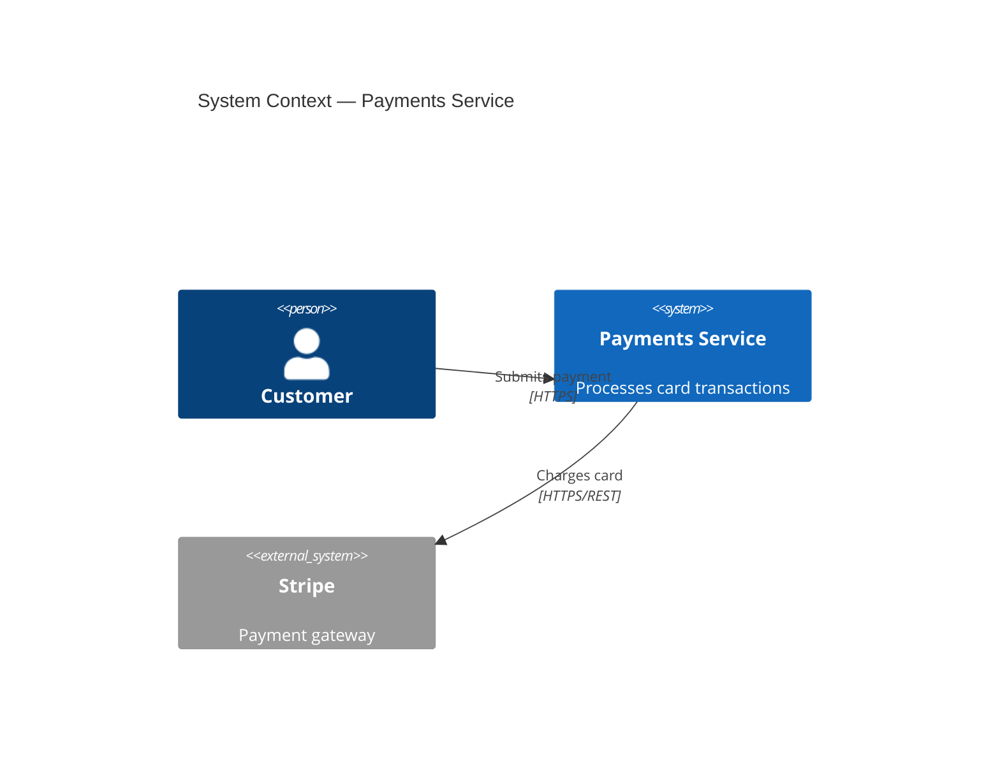

# Documentation Rules

Documentation is code. It lives in the repository, is reviewed in pull requests, is tested in CI, and follows the same quality bar as production software. Drift between code and docs is a defect.

---

## 1. README

Every repository and every top-level service directory **MUST** contain a `README.md`.

### Required sections

A root `README.md` **MUST** include:

| Section | Content |
|---|---|
| **Title + one-liner** | Name of the project and what problem it solves in one sentence |
| **Status badge(s)** | CI, coverage, or deployment status |
| **Prerequisites** | Runtime versions, required tools, environment variables |
| **Quick start** | Fewest commands to get from clone to running |
| **Links** | Architecture docs, API reference, deployment runbooks, ADR log |

A service subdirectory `README.md` **MUST** include its bounded-context purpose, its public interface summary, and a link to its ADRs.

### Rules

- READMEs **MUST** be kept accurate; a stale README **MUST** be updated in the same PR that makes the code change.
- The quick-start section **MUST** be verified runnable before merging. Use CI to test setup scripts.
- READMEs **SHOULD** not exceed 150 lines. Detail belongs in dedicated docs, not the README.
- READMEs **MAY** include architecture diagrams rendered from source (Mermaid, PlantUML) checked into the repo.

### Example quick-start block

```markdown
## Quick start

```bash
# 1. Install dependencies
npm install

# 2. Copy environment template
cp .env.example .env

# 3. Start services
docker compose up -d

# 4. Run the app
npm run dev
```

App is now available at http://localhost:3000.
```

---

## 2. Architecture Docs

Architecture documentation **MUST** live inside the repository under `docs/architecture/`.

### Required artifacts

- A **system context diagram** (C4 Level 1) showing external actors and system boundaries.
- A **container diagram** (C4 Level 2) showing deployable units and their communication.
- A **data flow diagram** for every integration that crosses a trust boundary.

### Rules

- Diagrams **MUST** be expressed as code (Mermaid, PlantUML, or structurizr DSL) committed alongside the documentation.
- Rendered image exports **MAY** be committed for tooling that cannot render source, but the source file is authoritative.
- Architecture docs **MUST** be updated whenever a container, integration, or data boundary changes. The PR description **MUST** reference which diagrams were updated.
- Architecture docs **SHOULD** follow the arc42 or C4 model structure for consistency.
- A "last reviewed" date **MUST** appear at the top of each architecture document.

### Example diagram (Mermaid)

```markdown

```

---

## 3. Architecture Decision Records (ADRs)

Architecturally-significant decisions **MUST** be captured in ADRs. An ADR documents not just *what* was decided but *why*, including rejected alternatives.

### When to write an ADR

An ADR **MUST** be written when the decision:

- Affects more than one service or team.
- Chooses a technology, framework, or vendor.
- Establishes a data contract or API shape that other parties depend on.
- Contradicts an existing ADR.
- Will be difficult to reverse without significant effort.

An ADR **SHOULD** be written when the decision introduces a new pattern or deviates from an existing one.

An ADR **MAY** be skipped for self-contained, easily reversible decisions that affect only the author's own code.

### File naming

ADR files **MUST** follow the pattern:

```
docs/adr/NNNN-<present-tense-imperative-phrase>.md
```

Examples:
```
docs/adr/0001-use-postgresql-for-primary-store.md
docs/adr/0012-adopt-event-sourcing-for-audit-log.md
docs/adr/0023-replace-rest-with-graphql-for-mobile-clients.md
```

- Numbers **MUST** be zero-padded to four digits and monotonically increasing.
- File names **MUST** use lowercase and hyphens only.

### Required sections (Nygard + MADR hybrid)

```markdown
# NNNN. <Title>

* **Status**: proposed | accepted | rejected | deprecated | superseded by [NNNN](link)
* **Date**: YYYY-MM-DD
* **Deciders**: @handle, @handle

## Context and Problem Statement

<Two to three sentences. What situation forced this decision?>

## Decision Drivers

* <driver 1>
* <driver 2>

## Considered Options

* Option A — <short label>
* Option B — <short label>

## Decision Outcome

**Chosen option**: Option A, because <justification>.

### Positive Consequences

* <consequence>

### Negative Consequences / Trade-offs

* <consequence>

## Pros and Cons of the Options

### Option A

* Good: <reason>
* Bad: <reason>

### Option B

* Good: <reason>
* Bad: <reason>

## Links

* Supersedes [NNNN](link)
* Related requirement: <ticket URL>
```

### ADR lifecycle states

| State | Meaning |
|---|---|
| `proposed` | Under discussion, not yet binding |
| `accepted` | Binding; implementation may proceed |
| `rejected` | Considered and declined; record kept for context |
| `deprecated` | Was accepted; no longer the current approach but not yet superseded |
| `superseded by NNNN` | Replaced by a newer ADR |

### Rules

- ADRs **MUST NOT** be deleted. Outdated decisions **MUST** be marked `deprecated` or `superseded`.
- Existing ADR content **MUST NOT** be altered after acceptance. Amendments **MUST** be added as a new dated section or as a new ADR that supersedes the old one.
- An ADR **MUST** be reviewed by at least one person who was not its author before moving from `proposed` to `accepted`.
- Each ADR **MUST** have a named primary owner (`@handle`) who is responsible for keeping its status current.
- Fitness functions or CI checks **SHOULD** be written to enforce accepted ADRs automatically (e.g., ArchUnit rules that verify no direct database calls from the presentation layer).

### Example — complete ADR

```markdown
# 0007. Use PostgreSQL as the primary datastore

* **Status**: accepted
* **Date**: 2025-03-14
* **Deciders**: @alice, @bob

## Context and Problem Statement

We need a durable, queryable store for user and order records. We evaluated
relational and document-oriented options after the SQLite prototype hit
write-concurrency limits in load testing.

## Decision Drivers

* ACID guarantees required for financial records
* Team has deep PostgreSQL operational experience
* Managed hosting available on our cloud provider

## Considered Options

* Option A — PostgreSQL
* Option B — MongoDB
* Option C — CockroachDB

## Decision Outcome

**Chosen option**: Option A (PostgreSQL), because it satisfies ACID requirements,
the team knows it well, and managed Aurora PostgreSQL eliminates operational burden.

### Positive Consequences

* Row-level locking prevents phantom reads during order checkout.
* Existing runbooks and on-call tooling transfer directly.

### Negative Consequences / Trade-offs

* Schema migrations require care at scale; we will adopt `sqitch` for migration management.
* Horizontal write scaling will require sharding or read replicas if write throughput exceeds 50k TPS.

## Links

* Supersedes [0003](0003-use-sqlite-for-local-dev.md) for production workloads
```

---

## 4. API Documentation

Public and internal APIs **MUST** be documented with machine-readable specifications.

### Rules

- REST APIs **MUST** be described with an OpenAPI 3.x spec committed to the repository at `docs/api/<service-name>.openapi.yaml`.
- GraphQL APIs **MUST** expose an introspectable schema and **MUST** commit a SDL file at `docs/api/<service-name>.graphql`.
- gRPC services **MUST** commit `.proto` files under `docs/api/` or `proto/` with a README that links them from the service docs.
- API specs **MUST** be validated in CI (e.g., `spectral lint`, `graphql-schema-linter`). A failing lint check **MUST** block merge.
- Every endpoint or operation **MUST** document: purpose, request shape, response shape, all non-2xx status codes, and authentication requirements.
- Breaking changes to a public API **MUST** be accompanied by an ADR and a new major version. Additive changes **MAY** be made in a minor version.
- Auto-generated reference docs **SHOULD** be published to a developer portal on merge to the main branch.

### Example OpenAPI stub

```yaml
openapi: "3.1.0"
info:
  title: Orders API
  version: "2.0.0"
  description: |
    Manages order lifecycle. See [ADR-0019](../adr/0019-orders-api-v2-shape.md)
    for the rationale behind the v2 breaking changes.
paths:
  /orders/{id}:
    get:
      summary: Retrieve a single order
      parameters:
        - name: id
          in: path
          required: true
          schema:
            type: string
            format: uuid
      responses:
        "200":
          description: Order found
          content:
            application/json:
              schema:
                $ref: "#/components/schemas/Order"
        "404":
          description: Order not found
        "401":
          description: Missing or invalid bearer token
```

---

## 5. Setup Instructions

Setup documentation **MUST** cover every path to a working development environment.

### Rules

- A `docs/setup.md` (or equivalent section in the root README) **MUST** exist and cover:
  - Required tool versions (language runtimes, Docker, CLI tools).
  - All environment variables, referencing `.env.example`.
  - Steps to seed or migrate the database for local use.
  - How to run the test suite to verify the setup succeeded.
- Environment variable names **MUST** be documented even if the value is secret. Use `<REDACTED>` or `see 1Password vault X` for secrets; never commit real credentials.
- Setup instructions **MUST** be OS-specific where behavior differs. Use tabbed or separate sections for macOS, Linux, and Windows.
- Setup instructions **SHOULD** be scripted (a `script/bootstrap` or `make setup` target) so they can be tested in CI.

### Example `.env.example`

```bash
# Database
DATABASE_URL=postgres://localhost:5432/myapp_dev   # local default
DATABASE_POOL_SIZE=5

# Auth
JWT_SECRET=<REDACTED>   # see 1Password: "myapp JWT secret (dev)"
JWT_EXPIRY_SECONDS=3600

# External services
STRIPE_API_KEY=<REDACTED>   # see 1Password: "Stripe test key"
```

---

## 6. Examples

Runnable examples **MUST** accompany any public API, SDK, or library.

### Rules

- Examples **MUST** live in a dedicated `examples/` directory at the repository root or within each package.
- Every example **MUST** be independently runnable (its own dependencies, clear entry point).
- Examples **MUST** be included in CI to catch regressions. A broken example **MUST** block merge.
- Examples **MUST** cover the primary happy path. Edge cases **SHOULD** be covered.
- Examples **MUST** be kept in sync with the API they demonstrate. When an API changes, its examples **MUST** be updated in the same PR.
- Examples **SHOULD** include inline comments only where the reasoning is non-obvious—not to restate what the code does.

### Example directory layout

```
examples/
  create-order/
    README.md          # < 50 lines: what it does, how to run it
    index.ts
    package.json
  webhook-handler/
    README.md
    handler.ts
    package.json
```

---

## 7. Changelogs

Every user-facing change **MUST** be recorded in a `CHANGELOG.md` at the repository root.

### Format

Use [Keep a Changelog](https://keepachangelog.com/) conventions:

```markdown
## [Unreleased]

## [2.1.0] - 2025-11-20

### Added
- `GET /orders/{id}/timeline` returns the full status history of an order.

### Changed
- `POST /orders` now accepts an optional `idempotency_key` header.

### Fixed
- Order status did not update when payment was refunded (#412).

### Deprecated
- `GET /v1/orders` is deprecated; use `GET /v2/orders`. Removal in v3.0.0.
```

### Rules

- Changelog entries **MUST** be written for human readers, not commit logs. Describe impact, not implementation.
- A changelog entry **MUST** be added for every PR that changes user-visible behavior.
- The `[Unreleased]` section **MUST** be present and **MUST** be populated before each release.
- Version entries **MUST** include a date in `YYYY-MM-DD` format.
- `Deprecated` items **MUST** include the version in which removal is planned.
- Changelogs **MUST NOT** be auto-generated solely from commit messages; a human **MUST** author the entry.

---

## 8. Contribution Workflow

Documentation changes follow the same pull-request workflow as code changes.

### Process

1. **Open an issue first** for non-trivial changes (new sections, structural reorganization, deprecating a policy). For typo fixes and factual corrections, a PR may be opened directly.
2. **Branch** from `main` using the naming convention `docs/<short-description>`.
3. **Write** the change following the content model in these rules.
4. **Self-review** before requesting review:
   - All code blocks are syntactically valid and tested.
   - Links resolve (run `npx markdown-link-check` or equivalent in CI).
   - Diagrams render correctly.
   - The changelog or release notes are updated if applicable.
5. **Request one reviewer** minimum. Architectural documentation changes **MUST** be reviewed by a system owner or tech lead.
6. **Merge** with a squash commit whose message summarizes the documentation change.

### Content types

Every piece of documentation **MUST** be classified as one of the following types, which determines its structure:

| Type | Purpose | Template cue |
|---|---|---|
| **Concept** | Explains *what* and *why*; no steps | "About \<subject\>" |
| **How-to** | Goal-oriented procedural steps | Present participle title |
| **Reference** | Lookup material (API fields, CLI flags, config keys) | Noun-phrase title |
| **Tutorial** | Learning-oriented, builds a complete thing end-to-end | "Build \<thing\>" |
| **ADR** | Captures a specific architecture decision | See Section 3 |

### PR checklist

All documentation PRs **MUST** pass the following checks before merge:

- [ ] Broken-link check passes in CI.
- [ ] Diagram source files (`.mmd`, `.puml`) committed alongside any rendered images.
- [ ] OpenAPI/GraphQL specs pass linting if modified.
- [ ] `CHANGELOG.md` updated if user-visible.
- [ ] ADR written (or existing ADR referenced) if the PR introduces or changes an architecturally-significant decision.
- [ ] Spelling and prose linting passes (`vale` or equivalent).

---

## 9. Deprecation Policies

Deprecated APIs, features, and documentation **MUST** follow a defined lifecycle before removal.

### For APIs and public interfaces

- Deprecation **MUST** be announced in the changelog under `### Deprecated` at least **one major version** before removal.
- The deprecation notice **MUST** include: what is deprecated, why, what replaces it, and the planned removal version.
- Deprecated endpoints **MUST** return a `Deprecation` response header (per [RFC 8594](https://datatracker.ietf.org/doc/html/rfc8594)) with the sunset date.
- Removal **MUST** be documented in a new ADR if the feature being removed had its own ADR.

### For documentation

- Documentation for deprecated features **MUST** carry a visible callout at the top:

```markdown
> **Deprecated.** This feature is deprecated as of v3.0.0. Use [new-feature](link) instead.
> It will be removed in v4.0.0.
```

- Deprecated docs **MUST NOT** be deleted until the feature is removed from the product.
- When a deprecated feature is removed, its documentation **MUST** be replaced with a stub that explains what happened and links to the migration guide.

### For ADRs

- When a decision is superseded, the original ADR **MUST** be updated with `Status: superseded by [NNNN](link)`.
- The superseding ADR **MUST** reference the original in its `Links` section.
- ADRs **MUST NOT** be deleted under any circumstances.

### Example deprecation callout

```markdown
> **Deprecated since v2.3.0.** `POST /v1/orders` is deprecated.
> Migrate to `POST /v2/orders` before **2026-06-01** (v3.0.0 release).
> See the [migration guide](docs/migrations/v2-to-v3.md) and [ADR-0031](docs/adr/0031-deprecate-orders-v1.md).
```
